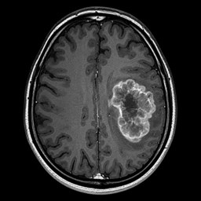
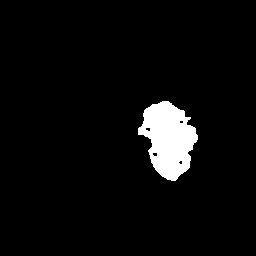
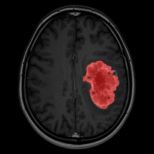

# 🧠 AI-Powered Brain MRI Tumor Analysis Platform

A Deep Learning-based Medical Image Segmentation system that detects and segments brain tumor regions from MRI scans using the U-Net architecture and Computer Vision techniques.

The project is deployed as a live AI web application using Streamlit and HuggingFace Spaces.

---

# 🚀 Live Demo

🌐 Live Application:  
https://devspace152004-ai-mri-tumor-analysis.hf.space

---

# 📌 Project Overview

This project focuses on Brain Tumor Segmentation using MRI images to identify tumor regions accurately through semantic segmentation.

The system uses a U-Net model with a ResNet34 encoder trained on MRI datasets to generate tumor masks and overlay visualizations in real-time.

The application assists in:
- Medical image analysis
- Tumor region visualization
- Deep Learning-based segmentation workflows
- AI-powered diagnostic support systems

---

# ✨ Features

✅ MRI Brain Tumor Segmentation  
✅ U-Net + ResNet34 Architecture  
✅ Real-time Tumor Mask Prediction  
✅ Tumor Overlay Visualization  
✅ Confidence Score Display  
✅ Dice Loss + BCE Loss Optimization  
✅ Streamlit-based Interactive Web App  
✅ Live Deployment on HuggingFace Spaces  

---

# 🛠️ Tech Stack

| Category | Technologies |
|---|---|
| Programming | Python |
| Deep Learning | PyTorch |
| Segmentation | U-Net |
| Computer Vision | OpenCV |
| Data Augmentation | Albumentations |
| Deployment | Streamlit + HuggingFace Spaces |
| Visualization | Matplotlib |
| Model Library | segmentation_models_pytorch |

---

# 🧠 Model Architecture

- U-Net Segmentation Architecture
- ResNet34 Encoder Backbone
- Binary Semantic Segmentation
- Dice Loss + BCE Loss
- Pixel-wise Tumor Prediction

---

# 📊 Model Performance

| Metric | Performance |
|---|---|
| Dice Score | 87% |
| Loss Function | Dice Loss + BCE Loss |
| Segmentation Type | Binary Segmentation |

---

# 📂 Dataset Used

### LGG MRI Segmentation Dataset
Used for training and validation of tumor segmentation masks.

### BraTS Dataset
Used for experimentation and evaluation purposes.

The datasets contain:
- Brain MRI images
- Ground truth tumor masks
- Segmentation annotations

---

# 🔄 AI Workflow Pipeline

```text
MRI Scan
   ↓
Image Preprocessing
   ↓
Data Augmentation
   ↓
U-Net Deep Learning Model
   ↓
Tumor Segmentation
   ↓
Mask Generation
   ↓
Overlay Visualization
```

---


# 🖼️ Sample Outputs

## 🧠 Original MRI



---

## 📍 Predicted Tumor Mask



---

## 🔴 Tumor Overlay Visualization


---

# ⚙️ Local Setup & Installation

## Clone Repository

```bash
git clone https://github.com/DevShrivastava152004/Brain_Tumour_Segmentation.git
```

## Move into Project Directory

```bash
cd Brain_Tumour_Segmentation
```

## Install Dependencies

```bash
pip install -r requirements.txt
```

## Run Application

```bash
streamlit run app.py
```

---

# 🌐 Deployment

The project is deployed publicly using:

- Streamlit
- HuggingFace Spaces

Deployment includes:
- AI inference pipeline
- MRI upload support
- Real-time tumor segmentation
- Interactive visualization interface

---

# 📈 Future Scope

- Attention U-Net Integration
- 3D MRI Segmentation
- Multi-class Tumor Segmentation
- Improved Medical Visualization
- GPU-based Inference Optimization
- Clinical Workflow Integration

---

# 👨‍💻 Author

## Dev Shrivastava

AI/ML Engineering Student focused on:
- Deep Learning
- Computer Vision
- Medical Imaging
- AI Product Development

---

# ⭐ Support

If you found this project useful, consider starring the repository.
